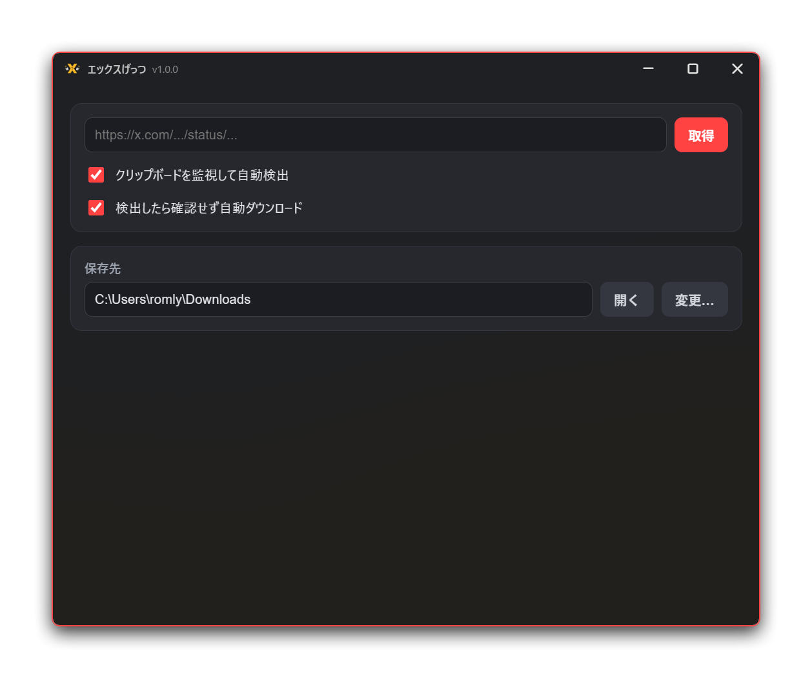

# エックスげっつ

画像、動画を含むエックスのポストのURLを貼り付けると、そのメディアファイルを自動的にダウンロードしてくれるツールです。
クリップボード監視機能も付いているので、ポストURLをコピーしていくだけで次々とダウンロードできます。




## ダウンロード

[最新リリース](https://github.com/Romly-Romly/x-gettsu/releases/latest) からインストーラをダウンロードして下さい。

### Windows

- **インストーラ版** — `*-setup.exe`

コード署名をしていないため、初回起動時に Windows SmartScreen の警告が表示されます。「詳細情報」をクリックし、「実行」を選ぶと起動できます。自己責任でどうぞ。

### macOS

- **ディスクイメージ** — `*_aarch64.dmg` (Apple Silicon 専用)

ダウンロードした `.dmg` を開き、中の `X-Gettsu.app` を「アプリケーション」フォルダにドラッグして下さい。未署名のためそのままでは開けず、 *ゴミ箱に捨てろ* と言われてしまいます(ひどい😭)。ターミナルから次のコマンドで検疫属性を外すと起動できるようになります。自己責任でどうぞ。

```sh
xattr -dr com.apple.quarantine /Applications/X-Gettsu.app
```


## 動作環境

| OS | バージョン |
|---|---|
| Windows | 10 / 11 (64bit) |
| macOS | 26 (Tahoe) 以降 (Apple Silicon) |


## 使い方

起動してURL欄にポストのURLを貼り付けて「取得」をクリックするとメディアの一覧が取得されるので、それぞれのダウンロードボタンでダウンロードします。

あるいは、「クリップボードを監視して自動検出」と「検出したら確認せず自動ダウンロード」をオンにすることで、URLをコピーするだけでメディアがダウンロードされます。

動画はポストに用意されている中で最高ビットレートのMP4を、画像はオリジナル画質(`name=orig`)をダウンロードします。

ダウンロードした各メディアはゴミ箱ボタンで削除できるので、要らなかったものはすぐに取り消せます(ごみ箱に移動されます)。

> [!NOTE]
> ポストの解析には fxtwitter API (api.fxtwitter.com) を利用しています。取得の際、ポストのURLが同APIへ送信されます。


## 設定

### 設定の保存先

設定とウィンドウ状態は以下の場所に保存されます。

| 内容 | ファイル |
|---|---|
| 各種設定 | `settings.json` |
| ウィンドウの位置・サイズ・最大化状態 | `window-state.json` |

いずれもOSごとに以下のフォルダへ置かれます。

| OS | フォルダ |
|---|---|
| Windows | `%APPDATA%\com.romly.xgettsu\` |
| macOS | `~/Library/Application Support/com.romly.xgettsu/` |


## 更新履歴

**[CHANGELOG](CHANGELOG.md)** を見てね。


## ライセンス

[GNU General Public License version 3](LICENSE) (GPL-3.0)

Copyright (C) 2026 Romly

このプログラムはフリーソフトウェアです。GPL-3 に従い、再頒布および改変ができます。改変版を頒布する場合は、同じ GPL-3.0 の下でソースコードを公開する必要があります。
